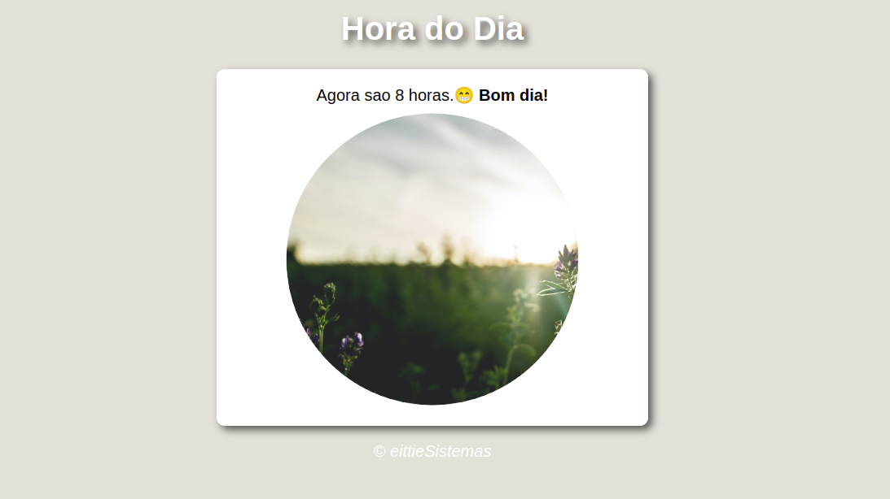

# Hora-Dia

Abra o brower e descubra em qual período do dia você está.:+1:
Não tem como dar errado. :sunglasses:

## Como executar o projeto :rocket:

Basta fazer download do projeto e executar em seu browser. :ok_hand:

## Licença :pencil:

Este projeto esta sob a licença MIT.

Feito com muito :heart: por Ívano Fontes :v: [Entre em contato!](https://www.linkedin.com/in/%C3%ADvano-da-silva-cruz-fontes-509b79152/)

 
